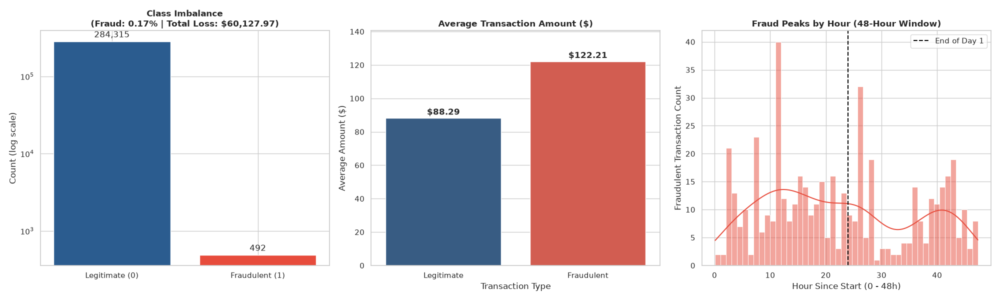

# Under Development

# 💳 Credit Card Fraud Detection & Exploratory Data Analysis

## 📌 Project Overview
This project provides an Exploratory Data Analysis (EDA) on credit card transaction datasets to identify patterns associated with fraudulent behavior. The goal is to extract actionable business insights for financial monitoring and anti-fraud systems.

---

## 🎯 Key Findings & Visualizations

### 1. Class Imbalance & Financial Loss
* **Insight:** Fraudulent transactions account for only **0.17%** of total dataset activity (492 cases vs. 284,315 legitimate transactions).
* **Financial Impact:** Total direct financial loss stands at **$60,127.97**.
* **Methodology:** Logarithmic scaling was applied to handle extreme class imbalance and properly visualize minor class metrics.

### 2. Transaction Value Analysis
* **Legitimate Avg. Amount:** $88.29
* **Fraudulent Avg. Amount:** $122.21
* **Takeaway:** Fraudulent transactions consistently exhibit higher average ticket sizes, providing a clear parameter for initial rule-based risk scoring.

### 3. Temporal Fraud Distribution
* **Observation:** Fraudulent activity peaks strongly during specific off-peak hours across the 48-hour window.
* **Takeaway:** Fraudsters tend to initiate automated testing batches during night hours when user response time to push notifications is highest.

---

## 🛠 Tech Stack
* **Language:** Python
* **Data Manipulation:** `pandas`, `numpy`
* **Data Visualization:** `matplotlib`, `seaborn`